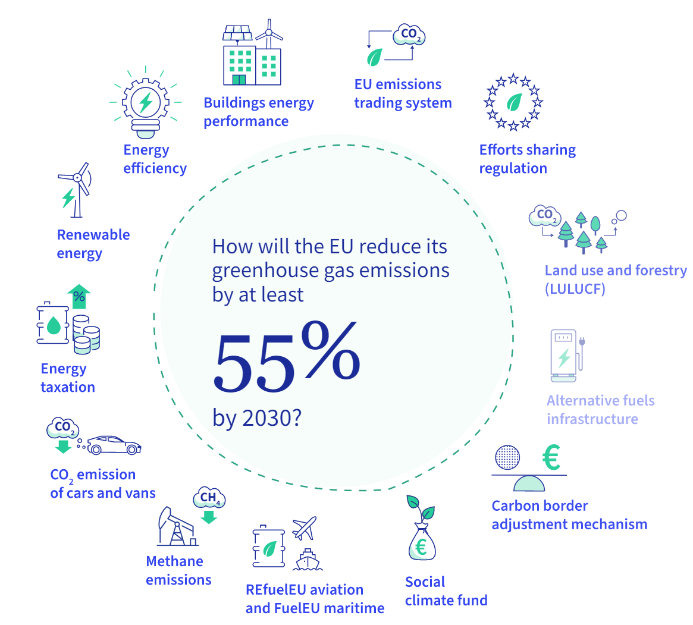

#building PDF: 
#renderthis::to_pdf("index.html")

```{r setup, include=FALSE}
options(htmltools.dir.version = FALSE)
```

```{r xaringan-themer, include=FALSE, warning=FALSE}
library(xaringanthemer)
style_mono_accent(
  base_color = "#01273C",
  text_font_family = "Heebo",
  text_font_url = "https://fonts.googleapis.com/css?family=Heebo",
  header_font_google = google_font("Heebo"),
  title_slide_text_color = "#FFFFFF",
  title_slide_background_image = "figures/eiee_title_page.png",
  #title_slide_background_size = "464 113",
  #title_slide_background_position = "bottom",
  text_slide_number_color = "#01273C",
  #header_h2_font_size = "2.0rem",
  header_h3_font_size = "1.4rem",

)


library(xaringanExtra)
use_logo(
  image_url = "figures/eiee_logo_small.png",
  width = "50px",
  height = "41px",
  position = css_position(bottom = "1em", left = "1em"),
)
```


```{r load, include=FALSE, warning=FALSE}
require(tidyverse)
require(plotly)


load("data/temp.Rdata")
load("data/alpha.Rdata")


```


<style>

.title-slide{
 #background: linear-gradient(to bottom, #01273C 0%, #01273C 55%, #295FA9 55%, #295FA9 80%, #FFFFFF 80%, #FFFFFF 100%);
 background-image: url("eiee_title_page.png")
 background-size: 100% 100%;
}


.remark-slide-content.hljs-default:not(.title-slide) {
  border-top: 80px solid #01273C;
  border-bottom: 10px solid #295FA9;
}

.remark-slide-content > h1 {
  font-size: 40px;
  margin-top: -80px;
  color: #fff;
  font-family:"Heebo";
}

.test{
 background: linear-gradient(to bottom, #01273C 0%, #01273C 55%, #295FA9 55%, #295FA9 80%, #FFFFFF 80%, #FFFFFF 100%);
 background-size: 100% 100%;
}

.title-slide h1 {
    margin-top: -100px;
}
.title-slide h2 {
    margin-top: -30px;
    margin-bottom: +90px;
}
.title-slide h3 {
    #margin-top: +50px;
    margin:10px;
}

</style>


<!--

class: title-slide, test, center, middle

<style>
.title-slide .remark-slide-number {
  display: none;
}
</style>


# WITCH and EU Climate Policies

## Fit for 55, 2040 target, ...

### Johannes Emmerling

### `r Sys.Date()`

-->

# An overview of European Climate Targets for 2030


     
---


# An overview of European Climate Targets for 2030

.pull-left[
1. Emission Target 2030: -40%(1990)<sup>*</sup>

1. Energy Efficiency Directive: -32.5% (Ref)

1. Renewables Target in FEN: 32% (Total)

1. Renewables Target in Electricity: % (Total)

1. Renewables Share in Transportation: 9%

1. Heating and Cooling by REN:

1. Social Climate Fund 65bln. EUR
]

--

.pull-right[
1. Emission Target 2030: -40%(1990)<sup>*</sup>

1. Energy Efficiency Target: -36%(FEN) / -39%(PES) (Ref)

1. Renewables Target in FEN: 40% / 45% (REPowerEU)

1. Renewables Target in Electricity: 65% / 69% (REPowerEU)

1. Renewables Share in Transportation: 29%

1. Heating and Cooling by REN:

]

.footnote[[*] Always indicating the reference where applicable]

---

# Scenarios


---

# Emissions Target

```{r out.width='100%', fig.height=7, include = T, echo = F, warning=F}
plotly::ggplotly(p = p_emi_eu)  %>% layout(legend = list(orientation = 'h', x = 0.3, y = -0.1)) %>% config(displayModeBar = F)

```

---

# Energy Efficiency Directive

- Demand for Total Final/Primary Energy

```{r out.width='100%', fig.height=7, include = T, echo = F, warning=F}
plotly::ggplotly(p = p_en_eu) %>% layout(legend = list(orientation = 'h', x = 0.3, y = -0.1)) %>% config(displayModeBar = F)

```

---

# Renewable Energy

- Share of Renewables in FEN and Electricity

```{r out.width='100%', fig.height=7, include = T, echo = F, warning=F}
plotly::ggplotly(p = p_ren_eu) %>% layout(legend = list(orientation = 'h', x = 0.3, y = -0.1)) %>% config(displayModeBar = F)

```

---

# Sectoral Renewable Shares

```{r out.width='100%', fig.height=7, include = T, echo = F, warning=F}
plotly::ggplotly(p = p_ren_dem_eu) %>% layout(legend = list(orientation = 'h', x = 0.3, y = -0.1)) %>% config(displayModeBar = F)

```

---


# How fast to reach net zero?

- So far, pledges implemented as **linear** trends $(\alpha=1)$.

$$emicap_{y}=(E_{2030}-E_{NZY})\left(1-\frac{y-2030}{NZY-2030}\right)^{\alpha}$$
--


```{r out.width='100%', fig.height=5, include = T, echo = F, warning=F, fig.align='center'}
emicap <- function(y,alpha) (1-((y-2030)/20))^alpha
df_emicap <- expand.grid(y = seq(2030, 2050), alpha=c(0.1,0.5,1,1.2,1.5,2,3)) %>% mutate(emicap=emicap(y,alpha))
ggplotly(ggplot(df_emicap) + geom_line(aes(y,emicap, color=alpha, group=alpha))) %>% config(displayModeBar = F)


```


---

# How fast to reach net zero?

- Using `pol_lts.gms` in WITCH master (uses emi_cap then converts to tax, additional constraints)

--

```{r out.width='100%', fig.height=7, include = T, echo = F, warning=F}
plotly::ggplotly(p = p_alpha_emicap, tooltip = c("color", "y")) %>% layout(legend = list(orientation = 'h', x = 0.3, y = -0.1)) %>% config(displayModeBar = F)

```

---

# How fast to reach net zero?

- Which speed is optimal?
--

```{r out.width='100%', fig.height=7, include = T, echo = F, warning=F}
plotly::ggplotly(p = p_alpha_welfare, tooltip = c("x", "y")) %>% layout(legend = list(orientation = 'h', x = 0.3, y = -0.1)) %>% config(displayModeBar = F)

```

---

# Conclusions

- Overall Current Policies, NDC, and Pledges work fairly well
- Final Energy reporting some fixes required
- Sectoral reporting a starting point but endogenous modelling next step
- Net Zero transition we could say something about it
- slighly convex shape ($\alpha=1.2-1.3$) seems reasonable

---